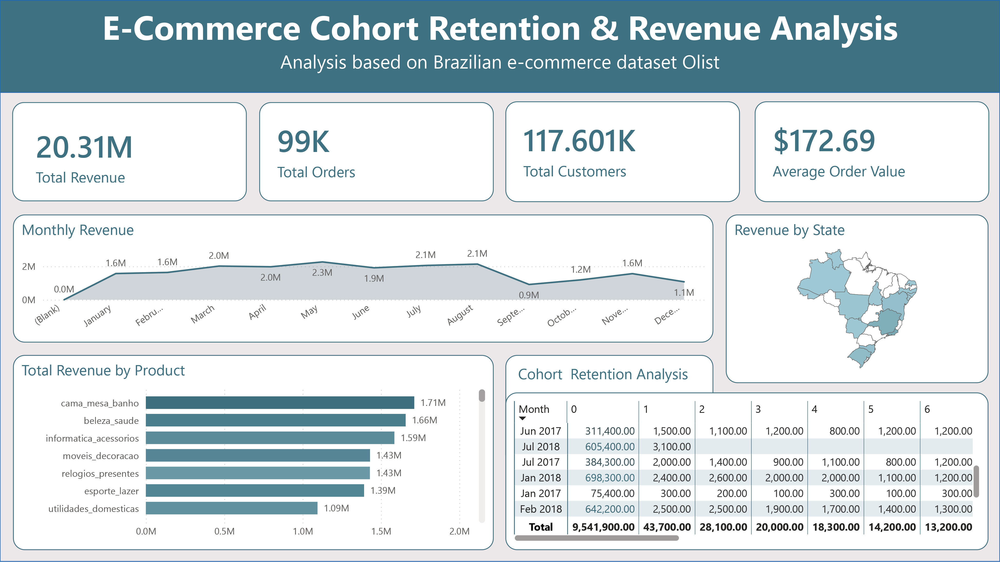

# E-Commerce Cohort Retention & Revenue Analysis

## Project Overview

A **full-stack data analytics portfolio project** analysing 99,441 delivered orders from Brazil's largest e-commerce marketplace, Olist. The project answers three core business questions:

> 1. **How well does Olist retain customers?** → Cohort retention analysis
> 2. **Which customers are most valuable?** → RFM segmentation
> 3. **What are the revenue trends and opportunities?** → Monthly revenue & category analysis

The pipeline runs from raw CSV data → SQL Server (analysis) → Power BI dashboard + an interactive Streamlit app → executive memo — mirroring how a real data analyst operates inside a company.

<div align="center">

[](https://www.microsoft.com/en-us/sql-server) [](https://powerbi.microsoft.com/) [](https://www.python.org/) [](https://pandas.pydata.org/) [](https://streamlit.io/) [](https://plotly.com/)

### 🚀 [Live Demo](https://olistecommerceanalysis-ad9na7gudzyanqwb4ouqok.streamlit.app/)

[](https://olistecommerceanalysis-ad9na7gudzyanqwb4ouqok.streamlit.app/)

</div>

---

## Interactive App

A [Streamlit app](app/app.py) lets you explore the data live — no SQL Server or Power BI needed. It reads directly from a pre-cleaned Parquet export ([dashboard/olist_clean_dataset.parquet](dashboard/olist_clean_dataset.parquet)) and reproduces the same cohort retention, RFM, and revenue logic as the SQL scripts, ported to pandas in [app/analytics.py](app/analytics.py).

| Tab | What it shows |
|-----|----------------|
| **Overview** | KPI cards, monthly revenue trend, top categories, payment type mix |
| **Revenue** | Monthly revenue + MoM growth, revenue by category (adjustable top-N) |
| **Cohort Retention** | Cohort month × months-since-acquisition retention heatmap, average retention by month offset |
| **RFM Segmentation** | Customer/revenue by segment, recency-vs-frequency bubble chart, segment summary table |
| **Geography** | Revenue by state, top cities by order volume, revenue concentration by state |

All tabs share sidebar filters for order month range, customer state, and order status.

**Run it locally:**
```bash
pip install -r app/requirements.txt
streamlit run app/app.py
```

---

## Power BI Dashboard

<div align="center">


</div>

---


## Key Findings

| Metric | Value | Insight |
|--------|-------|---------|
| Total Revenue | **R$20.31M** | Across 2017–2018 |
| Total Orders | **99K** | Delivered orders only |
| Unique Customers | **117,601** | Across all Brazilian states |
| Avg Order Value | **R$172.69** | Per transaction |
| Month-1 Retention | **< 5%** | 4–5× below industry benchmark |
| Revenue Peak | **R$2.27M** | May 2017 |
| Revenue Trough | **R$0.91M** | September 2017 (–57% drop) |
| Top Category | **cama_mesa_banho** | R$1.71M gross revenue |

### Critical Finding — Retention Collapse

```
Nov 2017 Cohort:  Month 0 → R$721,700   Month 1 → R$4,000   (–99.4%)
Jan 2018 Cohort:  Month 0 → R$698,300   Month 1 → R$2,400   (–99.7%)
May 2017 Cohort:  Month 0 → R$356,000   Month 1 → R$1,700   (–99.5%)
```

Olist operates as a **one-time purchase marketplace**. Virtually no organic repeat-purchase behaviour exists across any cohort.

---

## Repository Structure

```
olist-ecommerce-analysis/
│
├── app/
│   ├── app.py                     # Streamlit app (5-tab interactive dashboard)
│   ├── analytics.py                # Pandas port of the SQL cohort/RFM/revenue logic
│   ├── theme.py                    # Shared Plotly colour palette & layout
│   └── requirements.txt            # App dependencies
│
├── sql/
│   ├── 01_schema.sql              # Database + table creation (SQL Server)
│   ├── 02_cohort_retention.sql    # Monthly cohort retention with window functions
│   ├── 03_rfm_segmentation.sql    # RFM scoring + customer segmentation
│   └── 04_revenue_analysis.sql    # Monthly revenue, MoM growth, category breakdown
│
├── eda/
│   ├── 01_eda.ipynb               # Exploratory data analysis
│   └── 02_export_for_bi.ipynb     # Data export for Power BI
│
├── dashboard/
│   ├── dashboard.pbix             # Power BI dashboard file
│   ├── dashboard.jpg              # Dashboard screenshot
│   ├── olist_clean_dataset.csv    # Clean dataset for Power BI
│   └── olist_clean_dataset.parquet # Clean dataset used by the Streamlit app
│
├── data/
│   ├── olist_customers_dataset.csv
│   ├── olist_orders_dataset.csv
│   ├── olist_order_items_dataset.csv
│   ├── olist_order_payments_dataset.csv
│   ├── olist_products_dataset.csv
│   ├── olist_sellers_dataset.csv
│   ├── olist_geolocation_dataset.csv
│   ├── olist_order_reviews_dataset.csv
│   └── product_category_name_translation.csv
│
├── Memo/
│   └── executive_memo_final.pdf   # Executive memo with findings & recommendations
│
├── convert_to_sql.ipynb           # Data import script for SQL Server
├── dataset_link.txt               # Link to raw dataset
└── README.md
```

---

## Tech Stack

| Layer | Tool | Purpose |
|-------|------|---------|
| **Storage** | SQL Server (SSMS) | Data warehouse for all 5 tables |
| **Analysis** | SQL (CTEs, Window Functions) | Cohort retention, RFM, revenue queries |
| **Ingestion** | Python · Pandas · SQLAlchemy | CSV → SQL Server pipeline |
| **Web App** | Streamlit · Plotly · PyArrow | Interactive, filterable web dashboard |
| **Visualisation** | Power BI Desktop | Static interactive dashboard file |
| **Reporting** | Word / PDF | Executive memo |
| **Dataset** | Kaggle — Olist Brazilian E-Commerce | 9 CSV files, ~100K orders |

---

## Power BI Dashboard Pages

| Page | Visuals |
|------|---------|
| **Overview** | KPI cards (Revenue, Orders, Customers, AOV) · Monthly revenue trend · Brazil state map |
| **Cohort Retention** | Matrix heatmap — cohort month × months since acquisition |
| **Revenue by Product** | Horizontal bar chart — top categories by gross revenue |

---

## Executive Memo Summary

**Findings:**
1. Month-1 retention < 5% across all cohorts (benchmark: 20–25%)
2. Revenue peaked R$2.27M in May 2017, collapsed to R$0.91M by September (–57%)
3. Top 3 categories (cama_mesa_banho, beleza_saude, informatica_acessorios) = 24% of total revenue

**Recommendations:**
1. **Retention** — 3-touch post-purchase email sequence (Days 7, 14, 30) → est. +R$600K–R$1M/yr
2. **Seasonality** — Pre-position promos in August to smooth the Q3 revenue drop
3. **Re-engagement** — Win-back campaign for Lost RFM segment via beleza_saude category
4. **Geography** — Expand to North/Northeast states (35% of Brazil's population, underserved)

> Full memo: [`Memo/executive_memo_final.pdf`](Memo/executive_memo_final.pdf)

---

## Dataset

| File | Rows | Description |
|------|------|-------------|
| `olist_customers_dataset.csv` | 99,441 | Customer IDs and location |
| `olist_orders_dataset.csv` | 99,441 | Orders with timestamps and status |
| `olist_order_items_dataset.csv` | 112,650 | Line items with price and freight |
| `olist_order_payments_dataset.csv` | 103,886 | Payment values per order |
| `olist_products_dataset.csv` | 32,951 | Product categories and dimensions |

Source: [Olist Brazilian E-Commerce Public Dataset](https://www.kaggle.com/datasets/olistbr/brazilian-ecommerce) on Kaggle.


<div align="center">
<sub>Built with SQL Server · Power BI · Streamlit · Plotly · Python · Pandas · SQLAlchemy</sub>
</div>